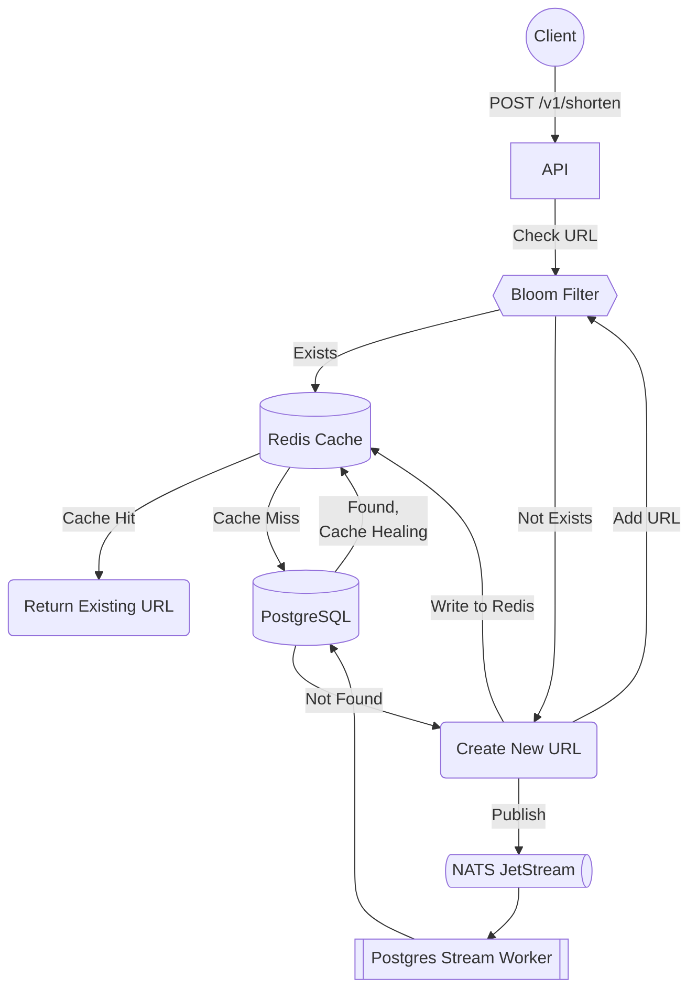
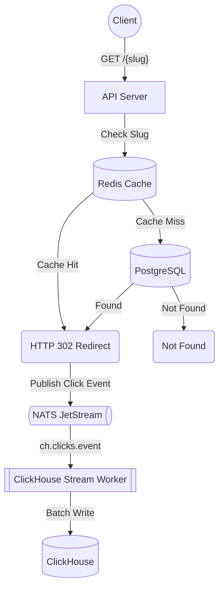
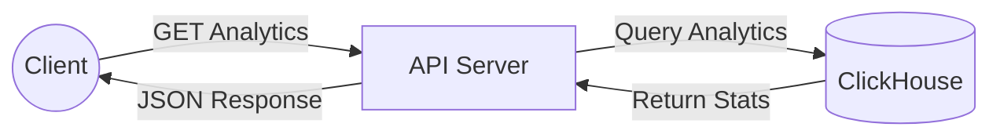
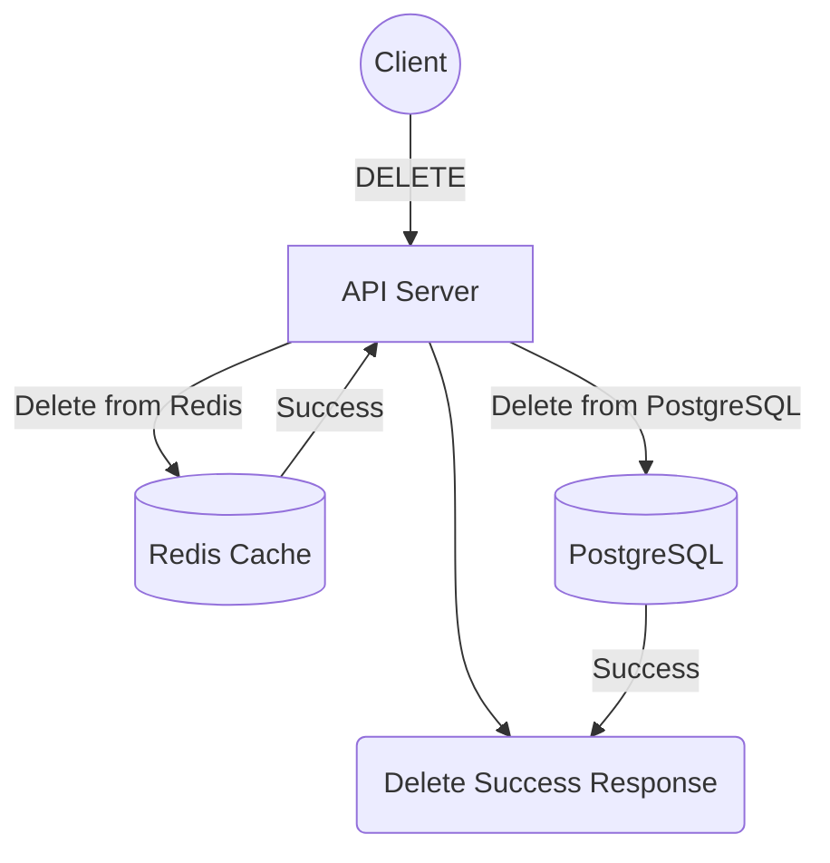

# MinURL

**High-Throughput Distributed URL Shortener with Analytics**. Built with Go,
featuring real-time analytics via ClickHouse, multi-layer caching with Redis,
and async stream processing with NATS JetStream.

## Core Stack & Capabilities

- **API Server & Routing**: Built with Go, Chi router, and middleware for robust recovery, validation, and SSRF protection.
- **Data & Caching**: PostgreSQL for primary storage, backed by a multi-layer **Redis & Bloom filter** stack achieving 99%+ cache hit rates and instant duplicate detection.
- **Analytics Engine**: **ClickHouse** columnar database powering real-time tracking of clicks, referrers, and user agents.
- **Async Processing**: **NATS JetStream** handling event-driven background writes and decoupled stream processing.
- **Distributed IDs**: **Snowflake IDs** eliminating database bottlenecks for unique URL slug generation.
- **Development-Ready**: Containerized via Docker Compose with a clean API-first design.

## API Documentation

### Create Short URL

```bash
POST /v1/shorten
Content-Type: application/json
{
  "url": "https://example.com",
  "expires_at": "1w"  // optional: 1d, 1w, 1m, 1y
}
```



**Response:**

```json
{
  "short_url": "http://localhost:4000/2uD3f3GldJe",
  "url": "https://example.com/"
}
```

### Redirect to Original URL

```bash
GET /{slug}
```



**Response:** 302 redirect to original URL

### Get URL Analytics

```bash
GET /v1/minurls/{slug}?from=2026-08-28T07:00:00Z&to=2026-08-28T08:00:00Z&limit=100
```



**Response:**

```json
{
  "total_clicks": 42,
  "top_referrers": [
    {"referrer": "Direct", "clicks": 30},
    {"referrer": "https://google.com", "clicks": 12}
  ]
}
```

### Delete Short URL

```bash
DELETE /v1/minurls/{slug}
```



**Response:**

```json
{
  "message": "minurl deleted successfully"
}
```

### Health Check

```bash
GET /v1/healthcheck
```

**Response:**

```json
{
  "status": "available",
  "system_info": {
    "environment": "development",
    "version": "1.0.0"
  }
}
```

## Performance Optimizations

1. **Multi-layer Caching**: Redis cache backed by Bloom filter pre-checks,
   achieving a 99%+ cache hit rate and bypassing database lookups for popular
   links.
2. **Batch Processing**: NATS JetStream batches database writes to maximize
   throughput and minimize database lock contention.
3. **Async Redirection & Logging**: Non-blocking analytics publishing ensures
   zero added latency during HTTP 302 redirects.
4. **Connection Pooling**: Configured connection pools across PostgreSQL and
   ClickHouse to eliminate connection churn.
5. **Distributed ID Generation**: Snowflake IDs eliminate database round-trips
   or auto-increment bottlenecks during slug creation.
6. **Optimized Analytics Queries**: ClickHouse columnar storage and
   query-splitting skip expensive operations for fast aggregation.

## Tech Stack

- **Language**: Go 1.26
- **Web Framework**: Chi v5
- **Databases**:
  - PostgreSQL 18 (primary storage)
  - ClickHouse (analytics)
  - Redis Stack (caching + Bloom filters)
- **Message Queue**: NATS with JetStream
- **Containerization**: Docker & Docker Compose
- **Migrations**: Goose
- **Logging**: structured logging with slog

## Prerequisites

- Docker & Docker Compose
- Go 1.26+ (for local development)
- Make or Just (optional, for build commands)

## Quick Start

### Using Docker Compose

```bash
# Clone the repository
git clone https://github.com/ukiran03/minurl
cd minurl
# Start all services
docker compose up -d
# Check service status
docker compose ps
# View logs
docker compose logs -f app
```

The API will be available at `http://localhost:4000`

### Configuration

Configuration is handled via environment variables and command-line
flags:

| Variable            | Description                  | Default               |
|---------------------|------------------------------|-----------------------|
| `PORT`              | API server port              | 4000                  |
| `POSTGRES_DSN`      | PostgreSQL connection string | -                     |
| `REDIS_ADDR`        | Redis address                | -                     |
| `NATS_URL`          | NATS connection URL          | -                     |
| `CLICKHOUSE_HOST`   | ClickHouse host              | -                     |
| `CLICKHOUSE_DB`     | ClickHouse database name     | -                     |
| `SNOWFLAKE_NODE_ID` | Snowflake node ID (0-1023)   | -                     |
| `BASE_URL`          | Base URL for short links     | http://localhost:4000 |


## Testing

```bash
# Run unit tests
go test ./...
# Run with race detector
go test -race ./...
# Run specific package tests
go test ./internal/flake
```

## Security Features

- **Validation & SSRF Protection**: Blocks internal IPs/localhost and enforces HTTP/HTTPS schemes.
- **Resilience Ready**: Architecture supports rate-limiting middleware and secure headers.

## Known Issues & Future Improvements

### Current Issues

- Health check doesn't verify database connectivity (shallow check)
- Cache/stream inconsistency edge cases when NATS publish fails after
  cache write

### Planned Enhancements

- [ ] Deep health checks with database connectivity verification
- [ ] Compensation transactions for failed stream publishes
- [ ] Kubernetes deployment manifests
- [ ] Metrics/Prometheus integration
- [ ] Rate limiting middleware
- [ ] Custom slug support
- [ ] ClickHouse background job for expired record cleanup
- [ ] Simple WebUI (templ, htmx)
- [ ] Webhook notifications for analytics events

**Note**: This project was designed to showcase modern Go backend
development practices including clean architecture, distributed systems
concepts, and performance optimization techniques.
